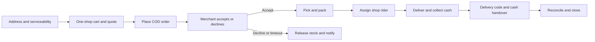

# SirfBazar local-store delivery: implementation plan

Status: ready to start · Created: 27 September 2026 · Owner: SirfBazar team

This is the working checklist for turning SirfBazar into a society-to-doorstep marketplace fulfilled by each shop's own delivery workers. Read [the product and research plan](local-store-delivery-plan.md) for the business model, customer journey, and source research. Update this file as work is verified; a task is complete only when its acceptance checks pass.

## Goal and first release

Enable a resident in one pilot society cluster to order available goods from **one local shop**, have that shop accept and pack the order, assign **its own rider**, deliver to the resident's house, collect cash, and close the order with a delivery code and reconciled cash record.

The first release includes customer web/mobile, merchant mobile/web, rider mobile, admin operations, the API, and a production-safe database. It does **not** require a dark store, shared rider fleet, multi-shop checkout, wallet spending, or an online payment gateway. These existing or future capabilities must not appear as usable pilot options unless they work end to end.

### Working assumptions to validate with pilot shops

| Decision | Proposed pilot default | Evidence needed before public orders |
| --- | --- | --- |
| Pilot location | One city and one society cluster | Named area, mapped gates/blocks and shop delivery boundaries |
| Shop cohort | 5–10 independent shops with existing riders | Signed operating terms and rider coverage during opening hours |
| Basket | One shop per checkout | Clear customer message if a cart contains another shop |
| Payment | Cash on delivery | Who collects, hands over, reconciles, and refunds cash in writing |
| Delivery fee | Shop-owned, set by delivery zone | Actual rider cost and customer willingness to pay |
| Platform revenue | Agreed commission and any disclosed platform fee | Shop margin and per-order economics; do not inherit the code's default 10% blindly |
| Delivery promise | Shop/zone-specific window | Measure preparation, rider wait, travel, and gate delays |
| Rider | Employed or contracted by that shop | Verified identity, availability, and support escalation contact |

The city, societies, commercial terms, and SMS provider are owner decisions. Engineering can implement configurable rules and test fixtures while field discovery runs.

## Baseline and source of truth

The repository already has merchant inventory, COD orders, status transitions, same-merchant rider assignment, delivery-code confirmation, support, notifications, and an admin panel. See [architecture](architecture.md), [API contract](api-contract.md), and [capabilities report](product-capabilities-report.md). These are foundations to test and adapt, not evidence of launch readiness.

`apps/api/prisma/schema.prisma` currently declares **PostgreSQL**. The SQLite and “do not change schema” statements in [backend-conventions.md](backend-conventions.md) are stale; follow the schema and executed tests. There is no reviewed migration chain yet. Create one before adding production data changes. Preserve existing worktree edits outside the task.

## Release flow and rules

Invariants for every implementation slice:

1. A shop sees only its orders and riders; a rider sees only orders assigned to that rider.
2. A checkout is rejected if any shop cannot serve the address, is closed, lacks stock, or has no safe delivery capacity under the configured rules.
3. The customer sees the final item total, shop delivery fee, any platform fee, and ETA before placing the order. Material changes require customer approval.
4. Status, inventory, payment, and cash changes are idempotent and have an audit trail. Retries must not create duplicate orders, charges, or payouts.
5. COD collected by the shop must never generate a duplicate platform payout to the shop.
6. Delivery completion requires the customer's code; cash amount and cash handover are recorded separately.
7. If live rider location is absent or stale, the customer sees status and an ETA, not a misleading moving map.

## Milestone 0 — Discovery, contracts, and baseline

**Outcome:** pilot rules and current behavior are measurable. Start this in parallel with technical audit.

- [ ] M0.1 Select the city and society cluster; list blocks, gates, house address patterns, gate rules, and fallback contact procedures.
- [ ] M0.2 Interview 10–15 shops and 20–30 households. Record top items, current phone-order volume, basket size, hours, stock update routine, delivery radius, worker schedule, cash flow, and complaints.
- [ ] M0.3 Recruit 5–10 shops with their own workers; record each shop's products, service area, fees, minimum basket, open hours, and realistic delivery window.
- [ ] M0.4 Agree merchant terms: inventory/pricing responsibility, delivery liability, cash custody, platform commission, promotions, cancellations, returns, support response, and permitted customer-data use.
- [ ] M0.5 Run the existing API smoke flow and manually walk a COD order through customer → merchant → rider → admin on actual devices. Capture defects in this checklist or linked issues.
- [ ] M0.6 Document the current database and take a verified backup before introducing migrations.

**Gate:** owner signs off on pilot location and COD responsibility; the team has a reproducible current-state walkthrough and backup.

## Milestone 1 — Safe money and database foundation (first engineering slice)

**Why first:** the current settlement generator treats delivered online-channel orders alike. For COD, the shop may already hold customer cash, so the existing generator can create a false payable amount. See `apps/api/src/settlements/settlements.service.ts`.

- [ ] M1.1 Define a single order money breakdown in **integer paisa**: item subtotal, shop delivery fee, platform fee, discounts by funding party, commission, customer total, collection party, refunded amount, and net owed in either direction.
- [ ] M1.2 Define the COD custody steps: rider collected → rider handed cash to shop → shop acknowledged → platform fee/commission invoiced or netted. Record actor, timestamp, amount, and order reference for each step. An exception can be opened for shortage or non-handover.
- [ ] M1.3 Add immutable or append-only ledger entries (or equivalent auditable records) and a calculation service; no money value is inferred solely from `DELIVERED` status.
- [ ] M1.4 Make COD settlement report **receivable from shop**, or zero payable with a separate invoice, according to the signed agreement. Digital-payment payout stays a separate future path. Block ambiguous legacy settlement rows from being marked paid until reconciled.
- [ ] M1.5 Baseline the existing PostgreSQL schema and add reviewed Prisma migrations. Use a disposable database for migration and rollback rehearsal; use `migrate deploy` for production. Do not run `prisma db push` against production.
- [ ] M1.6 Add focused tests for COD exact payment, short payment, refund, customer-approved replacement, duplicate handover event, discount funding, and mixed historical/legacy rows.

**Acceptance:** finance can trace every pilot order from checkout total to cash holder and any amount owed; a COD order already collected by the shop cannot produce a platform payout. A fresh database builds from migrations and a populated test database upgrades without losing orders.

## Milestone 2 — Society serviceability and checkout

- [ ] M2.1 Model a named society/zone and optional block, with merchant coverage, open/closed times, per-zone delivery fee, minimum order, and ETA inputs. Keep the current radius as a fallback during migration, not the sole pilot rule.
- [ ] M2.2 Require a valid house/address and map pin (or an explicitly verified society/block address) for delivery. Current checkout skips the radius check when address coordinates are missing; close this bypass.
- [ ] M2.3 Return serviceability and the quote from the API for the **selected address and shop**. Server recalculates it atomically at placement; changing the address invalidates the old quote.
- [ ] M2.4 Enforce one merchant per pilot checkout using a feature flag, while keeping existing multi-merchant records readable. Explain to the customer why another shop needs a separate order.
- [ ] M2.5 Hide mock online methods and unimplemented wallet spending from the pilot checkout. Keep COD visible only where the shop accepts it.
- [ ] M2.6 Update customer web and mobile screens for society/block/gate instructions, shop-specific fees, realistic ETA, replacement preference, and the final order confirmation.
- [ ] M2.7 Add tests for address outside zone, missing pin, closed shop, changed price, unavailable stock, minimum basket, and two-shop cart.

**Acceptance:** a customer can see only shops serving their address; every placed pilot order belongs to one shop with a correct, stable quote. Server validation rejects unsupportable orders even if a client bypasses the UI.

## Milestone 3 — Merchant fulfillment and rider capacity

- [ ] M3.1 Add merchant controls for busy/paused state, order acceptance window, delivery hours, active rider count, and maximum concurrent deliveries.
- [ ] M3.2 Make new-order alerts persistent on merchant app and portal: audible/visible alert, order age, accept/decline actions, notification retry, and admin escalation when the acceptance timer is near or expires.
- [ ] M3.3 Provide a pick-and-pack checklist. Resolve out-of-stock items with a customer-approved removal/replacement and recalculated total; never silently raise the amount.
- [ ] M3.4 Make rider assignment atomic. Verify rider belongs to shop, is approved/online, and is not already carrying an incompatible order; reject racing assignments.
- [ ] M3.5 Add rider pickup, arrival, failed-attempt reason, customer contact, delivery-code confirmation, collected cash amount, and handover acknowledgment in rider and merchant apps.
- [ ] M3.6 Set a GPS freshness rule and polling fallback. Only show live tracking when the active rider supplies recent location; keep customer status updates reliable when GPS permission/network is unavailable.
- [ ] M3.7 Test timeout, merchant decline, reassignment, rider offline, duplicate assignment, wrong delivery code, failed gate entry, cash shortage, and poor connectivity.

**Acceptance:** one shop can process an order end to end with its own rider, and every failure has a visible next action for customer, shop, rider, and support. No rider can be double-booked by concurrent requests.

## Milestone 4 — Admin operations, trust, and launch readiness

- [ ] M4.1 Add an operations queue for unaccepted, late, stuck, failed-delivery, cash-exception, replacement-waiting, and refund cases, each with owner and age.
- [ ] M4.2 Publish concise cancellation, returns/refund, delivery-fee, and dispute policies that match the merchant agreement. Capture support actions on the order timeline.
- [ ] M4.3 Replace mock OTP with a verified Pakistan-capable provider, remove demo credentials from production, fix role-preserving refresh tokens, and rate-limit sensitive endpoints.
- [ ] M4.4 Block restricted/prescription items from pilot checkout until a separate compliant workflow is implemented; validate uploads and protect merchant documents.
- [ ] M4.5 Establish supervised API/database/tunnel startup, health probes, alerting, daily backups, a restore drill, and a documented incident contact.
- [ ] M4.6 Add CI builds/typechecks for every shipped app and critical automated order/tenant tests. Run real-device acceptance tests across customer, merchant, and rider apps.
- [ ] M4.7 Use a release flag or allowlist for the pilot societies and shops. Verify the flag can pause new orders without hiding in-progress orders.

**Acceptance:** no mock login or mock payment path is exposed in the pilot; support can find and resolve every exception; critical processes recover after restart; a backup restore has been demonstrated.

## Milestone 5 — Controlled live pilot and expansion gate

- [ ] M5.1 Train each shop and rider with a practice order, substitution, cancellation, cash handover, and support call.
- [ ] M5.2 Launch one society cluster during staffed support hours. Review orders and cash exceptions daily; review shop inventory and rider capacity before opening.
- [ ] M5.3 Record actual acceptance time, delivery time against the **shown window**, item accuracy, stock-related cancellations, COD reconciliation time, repeat purchase, basket size, merchant margin, platform contribution, and support cost.
- [ ] M5.4 Meet the proposed scorecard in [the product plan](local-store-delivery-plan.md) for four consecutive weeks, or document why targets should change based on pilot evidence.
- [ ] M5.5 Decide whether to expand to another society, adjust fees/ETA, or improve reliability first. Add digital payments only after provider integration, verified callbacks, refunds, and reconciliation work end to end.

**Acceptance:** pilot performance and unit economics are measured per shop and zone; expansion is an evidence-based decision.

## Suggested work packets for agents or developers

Keep each packet small enough for review. Give one owner the API contract for a packet and require the relevant clients to follow it.

| Packet | Depends on | Main files/areas | Review evidence |
| --- | --- | --- | --- |
| P1 COD ledger and settlement guard | M0.4 cash decision | `apps/api/prisma/schema.prisma`, `apps/api/src/settlements`, `apps/api/src/payments`, `apps/api/src/orders` | Money examples, migration, tests, finance walkthrough |
| P2 Address and zone model | M0.1 area map | Schema, `apps/api/src/catalog`, `apps/api/src/customer`, merchant profile | Inside/outside zone and missing-address tests |
| P3 Quote and one-shop checkout | P2 | `apps/api/src/cart`, `apps/api/src/orders`, `apps/web/app/checkout`, `apps/customer-app` | Price/stock/fee race tests and UI walkthrough |
| P4 Merchant order reliability | P3 | `apps/api/src/notifications`, `apps/api/src/orders/merchant-orders.service.ts`, `apps/merchant-app`, `apps/shop` | Locked-screen and timeout device tests |
| P5 Rider/cash workflow | P1, P4 | `apps/api/src/rider`, `apps/rider-app`, merchant order UI | Double-assignment, code, cash and failed-delivery tests |
| P6 Operations and release | P1–P5 | `apps/admin`, infrastructure, CI, policies | Restore drill, incident drill, end-to-end pilot test |

## Definition of done for each packet

1. API contract and role/tenant permissions are written and reviewed before client changes.
2. Schema changes have a migration and data upgrade path; money stays in paisa.
3. Happy path and at least one meaningful failure path pass automated checks.
4. A customer, merchant, rider, or admin can understand the state and next action without developer help.
5. Relevant app typechecks/builds and an end-to-end manual or browser/device walkthrough pass.
6. Documentation, rollout flag, telemetry, and rollback/repair steps are updated where applicable.

## First task to pick up

**P1: COD ledger and settlement guard.** Begin by writing the approved COD cash-flow examples from M0.4 and focused tests that reproduce the current false-payout risk. Then implement the ledger/migration and settlement change. This protects every later pilot order and gives all client screens one authoritative set of money values.
