# SirfBazar: local shop to society doorstep plan

Research and repository review: 27 September 2026. This is a product and operating plan. Pilot numbers below are proposed targets to validate, not market benchmarks or existing performance.

To begin implementation, use the [working milestone checklist](LOCAL_STORE_DELIVERY_IMPLEMENTATION.md).

## 1. Product thesis

SirfBazar digitizes the order flow that already happens by phone: a resident calls a neighborhood shop, the owner prepares goods, and the shop sends its own delivery worker to the resident's house. SirfBazar supplies discovery, catalog, ordering, alerts, status, payment records, customer support, and reporting. Each shop retains ownership of its inventory, prices, staff, delivery workers, and fulfillment.

The customer promise should be **reliable delivery from trusted nearby shops**. Show a realistic time window per shop and area. Do not advertise a universal 10-minute guarantee until actual operating data supports it.

| Responsibility | SirfBazar | Local shop |
| --- | --- | --- |
| Customer acquisition and app | Owns | Participates |
| Product inventory and retail prices | Displays and audits | Owns and updates |
| Order acceptance and packing | Routes and records | Performs |
| Rider staffing and dispatch | Provides assignment/tracking tools | Employs and manages |
| Delivery fee and service area | Enforces/display terms | Sets terms within platform policy |
| Customer payment | Records and reconciles | Collects cash for COD; receives digital payout under chosen arrangement |
| Complaints and refunds | Coordinates and records | Resolves fulfillment faults under merchant agreement |

### Research behind the model

- Blinkit's partner program routes orders to partner operated dark stores, but Blinkit delivery partners handle the last mile. SirfBazar's last mile belongs to the existing shop and its own worker, so staffing capacity is merchant specific. [Blinkit partner program](https://partners.blinkit.com/).
- DoorDash Self-Delivery shows a marketplace can let merchants use their own drivers, define a delivery area, and set a delivery fee. This supports the merchant control proposed here; its fees and terms should not be copied to Pakistan. [DoorDash Self-Delivery](https://merchants.doordash.com/en-ca/products/self-delivery).
- Uber's merchant managed delivery guidance shows why the customer must be told who delivers, how to contact the shop, and what tracking is available. It also puts delivery execution with the merchant. [Uber merchant guidance](https://help.uber.com/merchants-and-restaurants/article/using-your-own-delivery-staff?nodeId=a37aee35-1dac-4509-ac8c-28c6aefbf265).
- Pakistan's State Bank supports merchant payments through Raast QR, aliases, IBAN, and Request to Pay. This is a later integration path, subject to a provider agreement and verified callbacks. [SBP Raast P2M circular](https://www.sbp.org.pk/circulars/pspod-circular-no-04-of-2023). Its [FY25 payment review](https://www.sbp.org.pk/PS/PDF/Annual-Payment-Systems-Review-FY25.pdf) reports strong account/wallet use in *digital e-commerce transactions*; that statistic does not measure or eliminate COD demand.

## 2. Core customer and fulfillment flow

```mermaid
flowchart LR
    A[Resident selects society, block and address] --> B[See open shops that deliver there]
    B --> C[Choose one shop and add in-stock items]
    C --> D[See final items, fees, ETA and payment method]
    D --> E[Place order]
    E --> F[Shop alert: accept or decline]
    F -->|Accept| G[Pick, verify and pack]
    G --> H[Assign one of shop's own riders]
    H --> I[Rider collects and delivers]
    I --> J[Customer confirms with delivery code]
    J --> K[Payment and cash record, rating, support]
    F -->|Decline or timeout| L[Notify customer and release stock]
    G -->|Out of stock| M[Offer replacement or remove item]
    M -->|Customer approves revised total| G
```

### Customer

1. Select society, block, street/house, gate instructions, phone, and a map pin. Show only shops serving the address and currently taking orders.
2. Browse by shop and product. State that each shop has its own prices, stock, delivery fee, and time window.
3. In the pilot, use a **one-shop cart**. Multi-shop orders create multiple deliveries, fees, and failure paths. Retain the existing multi-shop engine for later once each child delivery is clearly presented.
4. At checkout, show item prices, delivery fee, platform fee if any, minimum order, total, payment choice, replacement preference, and estimated delivery window. Recheck stock, price, service area, and rider capacity.
5. Show statuses: sent to shop, accepted, preparing, rider assigned, on the way, delivered. Provide shop contact and support. Show a map only when the shop rider app is sending a current location; otherwise show status and ETA.
6. Allow cancellation before shop acceptance. After acceptance, route changes and disputes through support with a clear policy.

### Shop owner or staff

1. Onboard and verify the shop. Set opening hours, closure/busy toggle, delivery societies/blocks, per-zone fee, minimum basket, normal preparation time, and maximum simultaneous deliveries.
2. Maintain a practical starter catalog: the top 100-300 repeat items, exact pack sizes, current prices, and available stock. Provide fast price/availability editing and a daily stock check. A wider catalog can follow.
3. Receive loud, persistent order alerts on the merchant app and web dashboard. Accept or decline within a configurable window, confirm an achievable ETA, and see substitutions/revised totals clearly.
4. Pick and pack against a checklist, mark ready, assign an active rider owned by that shop, and follow progress.
5. Review daily orders, COD cash, fees owed or payable, cancellations, and complaints.

### Shop rider

1. Log in under one approved shop. Mark availability and receive only that shop's assigned orders.
2. Confirm pickup, navigate to the exact house/gate, contact the customer through the order, and mark arrival.
3. Deliver only after the customer's one-time delivery code, record cash collected for COD, and report failed delivery with a reason. A phone call alone does not prove delivery.
4. Share live location only while actively assigned and with appropriate consent; show last update time to the customer.

### SirfBazar operations

Approve merchants, moderate products, monitor unaccepted/stuck orders, contact the customer and shop when needed, resolve missing/wrong-item and failed-delivery disputes, reconcile COD and digital payments, and review service quality by shop and society.

## 3. Failure paths to design before launch

| Event | Required handling |
| --- | --- |
| Shop misses alert or times out | Expire order, release reserved stock, notify customer, flag shop availability; support can help the customer reorder elsewhere. |
| Price or stock differs at packing | Shop proposes removal or replacement; customer approves the new item and total; no silent price increase. |
| No shop rider available | Disable fast ETA or pause orders; offer a later slot only if the shop explicitly supports it. |
| Rider cannot enter a society | Capture gate/contact instructions; rider contacts customer; log waiting time and failed attempt. |
| Customer unreachable or rejects delivery | Record evidence and reason; apply published return, fee, and cash policy. |
| COD amount does not match | Record expected, collected, short/excess amount, rider handover, and shop acknowledgment; open an exception. |
| App or internet is down | Merchant can call customer, but support records the final status and payment so the ledger matches reality. |

## 4. Money model and a critical code issue

Pilot with COD only after the cash flow is explicit. Proposed default: the rider collects the full checkout amount and hands it to the shop. The shop keeps product value plus its delivery fee, while SirfBazar invoices the agreed marketplace commission and any platform fee it is entitled to. For digital payment later, SirfBazar or its regulated payment partner receives/settles funds and pays the shop its share under a written agreement. The agreement must say who pays refunds, promotions, and rider costs.

**Critical current gap:** `apps/api/src/settlements/settlements.service.ts` generates a payable settlement from every delivered online-channel order without distinguishing COD cash already received by the shop. That can make a COD order look payable by the platform even though the shop already holds the cash. Do not run real payouts from this logic. Add a transaction ledger with `collectionParty`, `paymentMethod`, `gross`, `shopProductShare`, `shopDeliveryShare`, `platformCommission`, `platformFee`, `refunds`, `cashCollected`, `cashRemitted`, and `netPlatformToShop` or `netShopToPlatform`; reconcile each order before settlement.

Illustrative unit economics to validate: basket PKR 1,500, shop gross margin 12% = PKR 180, rider cost PKR 90, delivery fee PKR 80, platform commission 5% = PKR 75. The shop has PKR 95 left before packing, wastage, and overhead (`180 + 80 - 90 - 75`). These are hypothetical inputs; interview shops and measure actual margins and rider costs before choosing a commission. A flat 10% default in the current code may be unaffordable for some grocery baskets.

## 5. What SirfBazar already has, and what to change

| Area | Repository state | Next change |
| --- | --- | --- |
| Shops and catalog | Merchant inventory, price, hours, approval, and simple service radius exist. | Add society/block delivery zones, per-zone fees/windows, capacity and cutoff controls. |
| Checkout | COD and multi-merchant parent/child orders exist; stock is reserved at placement. | Start the pilot with one shop per checkout; require a usable address pin and show each fee and ETA. |
| Merchant fulfillment | Accept, reject, prepare, mark ready, assign own rider, and replacements exist. | Make alerts persistent and actionable; add packing checks, rider capacity, and fallback/escalation. |
| Rider delivery | Own-shop rider assignment, active delivery, location and delivery code exist. | Add COD collected amount, handover acknowledgment, failed attempt reasons, and GPS freshness. |
| Customer tracking | Status/timeline and tracking exist. | Communicate the shop delivery responsibility and the limits of live tracking. |
| Money | Commission and settlements exist; online methods are mock. | Fix COD ledger/settlement before commercial orders; integrate verified payment provider later. |
| Trust and operations | Admin, support, notifications and audit exist. | Replace mock OTP, remove demo credentials, add health checks/backups, dispute runbooks and merchant agreements. |

Other code specific observations: checkout currently checks the shop's `serviceRadiusKm` only when the saved address has coordinates, and the default delivery fee is global rather than shop/zone specific. Merchant rider assignment checks ownership but should also reject a rider already carrying an incompatible order. The documents in this repository report that Socket.IO server events exist while clients mainly poll; verify real device notifications under locked-screen and poor-network conditions.

## 6. Build sequence and decision gates

| Phase | Approximate duration* | Deliverable | Gate to continue |
| --- | --- | --- | --- |
| 0. Field discovery | 1-2 weeks | Interview 10-15 shops and 20-30 households in one selected society cluster; record current basket, delivery time, rider schedule, fees, stock handling, COD settlement, gate friction. | At least five shops commit to defined hours, catalog upkeep, and their own riders. |
| 1. Controlled pilot | 3-5 weeks | One-shop COD checkout, precise service areas, merchant alerts, real OTP, capacity/availability, COD ledger, admin exception queue, basic support and backups. | Test full order, substitution, timeout, failed delivery, cash handover, and refund flows with real devices. |
| 2. Live neighborhood pilot | 4-6 weeks | One society cluster, 5-10 shops, agreed delivery windows, staffed support during open hours, weekly reconciliation. | Four consecutive weeks meet the service and economic targets below. |
| 3. Scale within city | 6-10 weeks | More societies/shops, merchant self-service onboarding, catalog import, rider utilization tools, digital payments through a verified provider, improved dashboards. | Each new cluster reaches positive contribution margin and target reliability. |
| 4. Later | Based on demand | Multi-shop checkout, shared or overflow fleet, subscriptions, loyalty, advanced routing. | Prove that the feature solves a measured pilot problem. |

\*Durations are planning ranges, not commitments; they depend on team size, provider onboarding, and pilot fieldwork.

### Pilot scorecard (proposed thresholds)

- At least 90% of placed orders accepted within 5 minutes during published shop hours.
- At least 95% of accepted orders delivered within the **shown** time window; set the initial window from measured shop/rider performance, likely wider than a 10-minute promise.
- At least 97% of delivered orders have correct items or customer approved replacements.
- At least 95% of COD orders reconciled by the next business day; 100% of exceptions assigned an owner.
- Fewer than 2% of orders cancelled because the listed shop stock was wrong.
- Measure repeat purchase at 30 days, customer acquisition cost, average basket, shop gross margin, rider cost, platform revenue and support cost per order. Set expansion thresholds only after baseline data exists.

## 7. Immediate next decisions

1. Choose the first city, society cluster, and 5-10 shops with existing delivery workers.
2. Agree the merchant contract: service area/hours, who collects money, delivery fee ownership, commission, cancellations/refunds, customer data use, and customer support responsibilities.
3. Validate shop economics with actual baskets and rider costs; set a pilot commission rather than inheriting the current 10% default.
4. Prioritize the controlled-pilot changes in section 5 and run complete device tests before accepting public orders.
